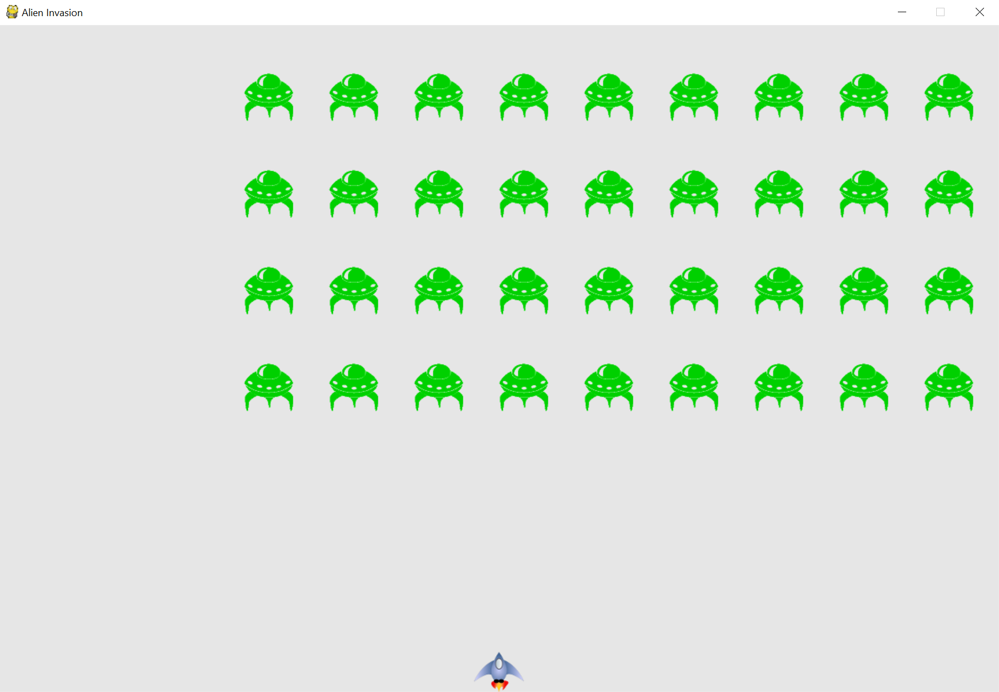

# Alien Invasion with Python and pygame
### A follow along project from [Python Crash Course](https://nostarch.com/pythoncrashcourse/)

### Python programming concepts used in this project:
- Extensive use of various data structures, including lists, dictionaries, tuples, strings, integers and floats.
- Extensive use of loops, conditionals and functions to create the game's functionality.
- Leverage an external python library, pygame, to streamline the development of the game.
- Use of python classes for Ships, Bullets and Aliens.
- Use of modules to compartmentalize different aspects of the game, making the codebase easier to write, maintain and understand.

### Screenshots of the game:

 
 
 

 
 
 
